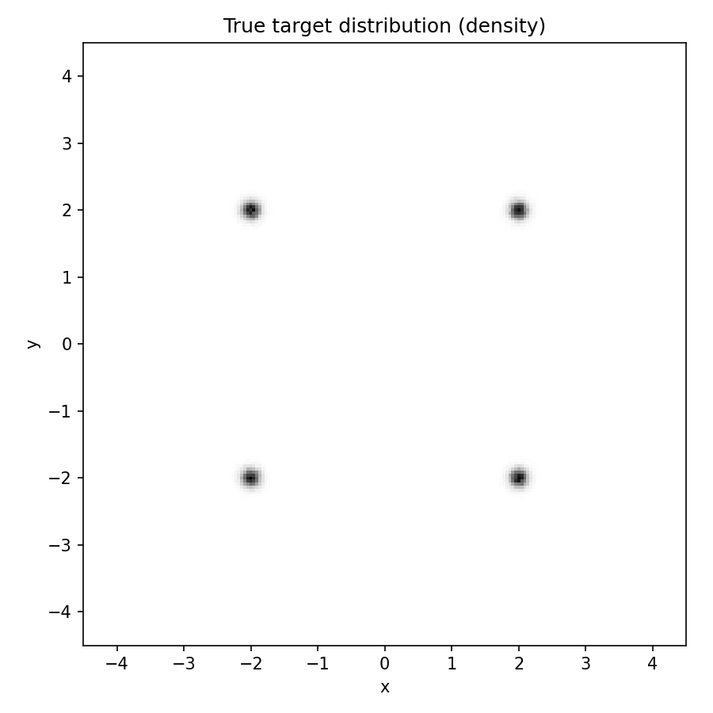

# Denoising Zoo

This is a clean, simple, hackable codebase for research on denoising models. From this, we hope you can gain a deeper understanding of how these models work and develop new research ideas.

  
  
  

## Getting Started

### MacOS

We provide a simple training script that uses UV to setup training to run on your MacOS Metal backend.

### Linux + NVidia

TODO

