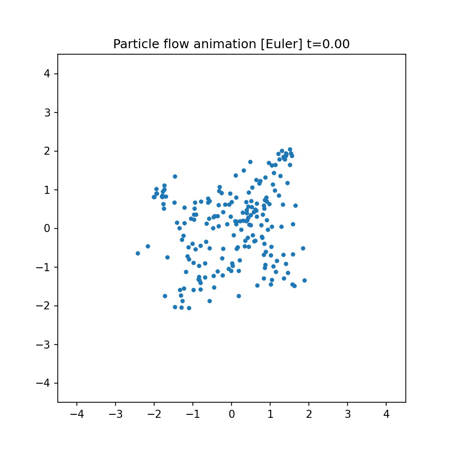

# Denoising Zoo

A clean, simple, hackable codebase for research on denoising models.

## Papers Implemented

- **Flow Matching**: [Flow Matching for Generative Modeling](https://arxiv.org/abs/2210.02747) (Lipman et al., 2022)
- **MeanFlow**: [Mean Flows for One-step Generative Modeling](https://arxiv.org/abs/2505.13447) - single-step generation via mean velocity fields
- **DiT**: [Scalable Diffusion Models with Transformers](https://arxiv.org/abs/2212.09748) (Peebles & Xie, 2023)

## Models

| Model | Params | Use Case |
|-------|--------|----------|
| MLP | <1M | 2D synthetic data |
| SmallCNN | ~0.5M | Small images |
| UNet | ~51M | CIFAR-10 (32×32 pixel space) |
| DiT-S | ~33M | Small latent experiments |
| DiT-B | ~131M | ImageNet latent (32×32×4) |
| DiT-L | ~458M | ImageNet latent |
| DiT-XL | ~675M | ImageNet latent |

## Datasets

- `kmeans`: 2D synthetic Gaussian mixtures
- `celeba`: CelebA faces (64×64)
- `cifar10`: CIFAR-10 (32×32)
- `imagenet`: ImageNet (latent space via SD VAE)

<p>
  
  
</p>

*Left: Learned velocity field evolving over time t∈[0,1]. Right: Particles transported from Gaussian noise (t=0) to target Gaussian mixture (t=1) via ODE integration.*

## Getting Started

Prerequisites:
- uv (for venv and dependency management)
- Python 3.12

The launcher handles creating a local `.venv/` via uv and syncing dependencies automatically.

## Usage

```bash
python launcher.py run_name=my_experiment
```

Device selection:
```bash
python launcher.py run_name=exp --device mps   # Apple Silicon
python launcher.py run_name=exp --device cuda  # NVIDIA
python launcher.py run_name=exp --device cpu
```

Hydra overrides:
```bash
python launcher.py run_name=exp epochs=100 eval_every=10
python launcher.py run_name=exp dataloaders=celeba model=cnn
python launcher.py run_name=exp dataloaders=cifar10 model=unet loss=meanflow
```

Enable `torch.compile` for kernel fusion (may improve GPU utilization):
```bash
python launcher.py run_name=exp compile=true
```

Checkpoints are saved at `outputs/ckpts/<arch>/last.pt`.

## Modal (Remote GPU)

One-time auth:
```bash
modal token new
```

Run on remote NVIDIA GPU:
```bash
python launcher.py --backend modal run_name=exp dataloaders=celeba model=cnn
```

Sync trackio logs from Modal (volume commits every 5 min during training):
```bash
python scripts/modal_app.py list   # list trackio runs in Modal volume
python scripts/modal_app.py sync   # download and merge with local trackio
```
Run `sync` periodically during long runs to monitor progress locally.

Download checkpoints from Modal:
```bash
python scripts/modal_app.py ckpts                    # list checkpoints
python scripts/modal_app.py download unet/last.pt   # download to outputs/ckpts/
```

Optional dataset persistence:
```bash
modal volume create training-data
```

## Visualization

Generate animations from a trained checkpoint:

```bash
cd visualizers && ./vis_all.sh [CKPT_PATH] [CFG_PATH]
```

Outputs to `outputs/vis/`:
- `kmeans_flow.gif` / `.mp4` - velocity field visualization
- `particles.gif` - particle transport (Euler solver)
- `particles_rk4.gif` - particle transport (RK4 solver)

Individual visualizers:
```bash
# Velocity field animation
python visualizers/kmeans_field_vis.py --ckpt outputs/ckpts/mlp/last.pt --out field.gif

# Particle transport
python visualizers/kmeans_particles_vis.py --ckpt outputs/ckpts/mlp/last.pt --out particles.gif --solver rk4
```

## Experiment Tracking (Trackio)

Training metrics are logged via [trackio](https://github.com/huggingface/trackio). View the dashboard:

```bash
trackio show --project denoising-zoo
```

Metrics logged:
- `train/loss` - logged every K batches (configurable via `trackio.log_every`)
- `eval/energy_distance` - logged at end of each epoch
- GPU metrics (MPS): `gpu/util_pct`, `gpu/power_w`, `gpu/temp_c`, `mps/allocated_mb`

CLI commands:
```bash
trackio list runs --project denoising-zoo
trackio get metric --project denoising-zoo --run <run_name> --metric "train/loss" --json
```

Disable tracking:
```bash
python launcher.py run_name=exp trackio.enabled=false
```

## Evaluation

### Why No Validation Loss?

This codebase does not compute a separate validation loss. This follows common practice in flow matching and MeanFlow work, where loss is a training objective rather than a reliable proxy for sample quality:

1. **Training MSE isn't predictive of generation quality.** Flow matching trains a velocity field; lower MSE on velocity targets does not necessarily mean better samples.

2. **FID is the primary quality metric.** Most generative modeling papers (including MeanFlow) report FID, which compares generated vs. real image distributions. Computing FID requires large sample sets (e.g., 50K) and is expensive, so this repo computes it only as a post-training evaluation.

3. **Energy distance during training (proxy).** Each epoch we compute energy distance on the eval split as a lighter-weight distributional metric between generated and real samples. It's more informative than MSE, but still a proxy and sensitive to sample count.

For final evaluation, generate samples and compute FID using standard tooling (e.g., `clean-fid`).
